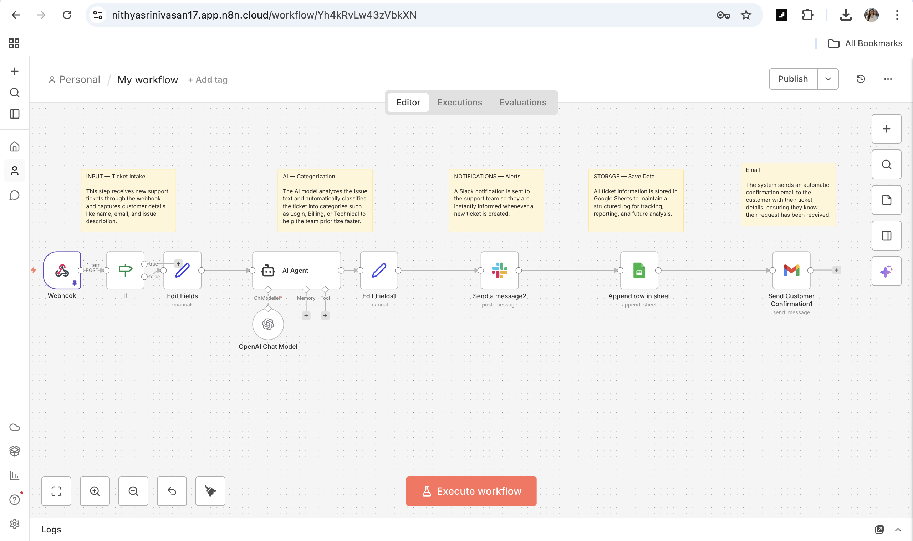

# 🤖 AI Support Ticket Automation

## 📌 Overview

This project is an end-to-end support automation workflow built using n8n.  
It automatically receives customer support tickets, categorizes them using AI, notifies the team, stores structured data, and sends confirmation emails — creating a fully automated support pipeline.

The goal of this project is to demonstrate how AI, automation, and service integrations can streamline real-world support operations and reduce manual effort.

## 🚀 What This Workflow Does

• Receives support tickets via webhook  
• Uses AI to classify the issue type  
• Sends instant Slack notifications to the team  
• Logs ticket data in Google Sheets  
• Sends automated confirmation emails to customers  
• Generates structured data for reporting  

## 🧠 Workflow Architecture

Webhook → Data Processing → AI Categorization → Slack Notification → Google Sheets Storage → Email Confirmation

## 🛠️ Tech Stack

n8n — Workflow orchestration  
OpenAI — Issue classification  
Slack — Team notifications  
Google Sheets — Ticket storage  
Gmail — Email automation  

## 💡 Key Highlights

• Event-driven automation design  
• Real AI integration in a practical workflow  
• Multi-service orchestration  
• Scalable and modular workflow structure  

## 📸 Screenshots

## 🎯 Business Value

This automation demonstrates how organizations can reduce manual support workload, improve response time, maintain structured ticket tracking, and scale support operations efficiently.

## 📚 What I Learned

• Designing event-driven workflows  
• Integrating AI into business processes  
• Connecting multiple services in automation  
• Structuring real-world automation projects  

## 🔮 Future Improvements

• Priority and sentiment detection  
• Advanced error-handling workflow  
• Analytics dashboard  
• Database integration  

## 👩‍💻 Author

Nithya Srinivasan  
Automation & Cloud Enthusiast
